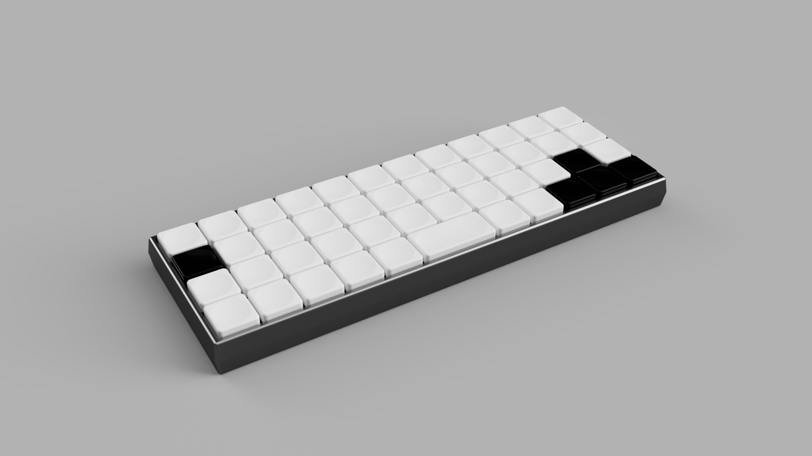

# koiboard
> What is this?
- Koiboard is a 40% ortholinear mechanical low-profile keyboard.
> How do you use it?
- Well you know how to you a keyboard, right? This one just has its keys aligned differently!
> Why did I make this?
- Honestly, I saw the simplicity of the [XYZ Work Board](https://worklouder.cc/xyz-work-board-2), plus other boards, and thought I could make it myself.

## 3D render

## PCB

### Layer 1

### Layer 2

### Layer 3

### Layer 4

### 3D render

### Schematic
This is split up into multiple pages. Check pcb/exports/koiboard.pdf!

## BOM
| Designator | Quantity | Value | LCSC Part # | JLCPCB Link |
| :---: | :---: | :---: | :---: | :---: |
| BOOT1, RST1 | 2 | - | C455262 | [Link](https://jlcpcb.com/partdetail/XUNPU-TS_1087S01526/C455262) |
| C1, C2, C14 | 3 | 1u | C14445 | [Link](https://jlcpcb.com/partdetail/15107-CL05A105KP5NNNC/C14445) |
| C4...13 | 10 | 100n | C1525 | [Link](https://jlcpcb.com/partdetail/1877-CL05B104KO5NNNC/C1525) |
| C15, C16 | 2 | 33p | C1562 | [Link](https://jlcpcb.com/partdetail/1914-0402CG330J500NT/C1562) |
| C3 | 1 | 10u | C1691 | [Link](https://jlcpcb.com/partdetail/2043-CL10A106MQ8NNNC/C1691) |
| **D1...49** | 49 | - | C2099 | [Link](https://jlcpcb.com/partdetail/2456-1N4148W/C2099) |
| F1 | 1 | - | C99563 | [Link](https://jlcpcb.com/partdetail/Littelfuse-1206L075THYR/C99563) |
| J1 | 1 | - | C5370443 | [Link](https://jlcpcb.com/partdetail/Korean_HropartsElec-TYPE_C_31_M40/C5370443) |
| **R1...5** | 5 | 5.1k | C25905 | [Link](https://jlcpcb.com/partdetail/26648-0402WGF5101TCE/C25905) |
| R6, R9 | 2 | 1k | C11702 | [Link](https://jlcpcb.com/partdetail/12256-0402WGF1001TCE/C11702) |
| R7, R8 | 2 | 27 | C25100 | [Link](https://jlcpcb.com/partdetail/25843-0402WGF270JTCE/C25100) |
| U1 | 1 | - | C5446 | [Link](https://jlcpcb.com/partdetail/TorexSemicon-XC6206P332MRG/C5446) |
| U2 | 1 | - | C7519 | [Link](https://jlcpcb.com/partdetail/STMicroelectronics-USBLC62SC6/C7519) |
| U3 | 1 | - | C2040 | [Link](https://jlcpcb.com/partdetail/RaspberryPi-RP2040/C2040) |
| U4 | 1 | - | C97521 | [Link](https://jlcpcb.com/partdetail/WinbondElec-W25Q128JVSIQ/C97521) |
| Y1 | 1 | - | C20625731 | [Link](https://jlcpcb.com/partdetail/AbraconLLC-ABM8_272T3/C20625731) |
